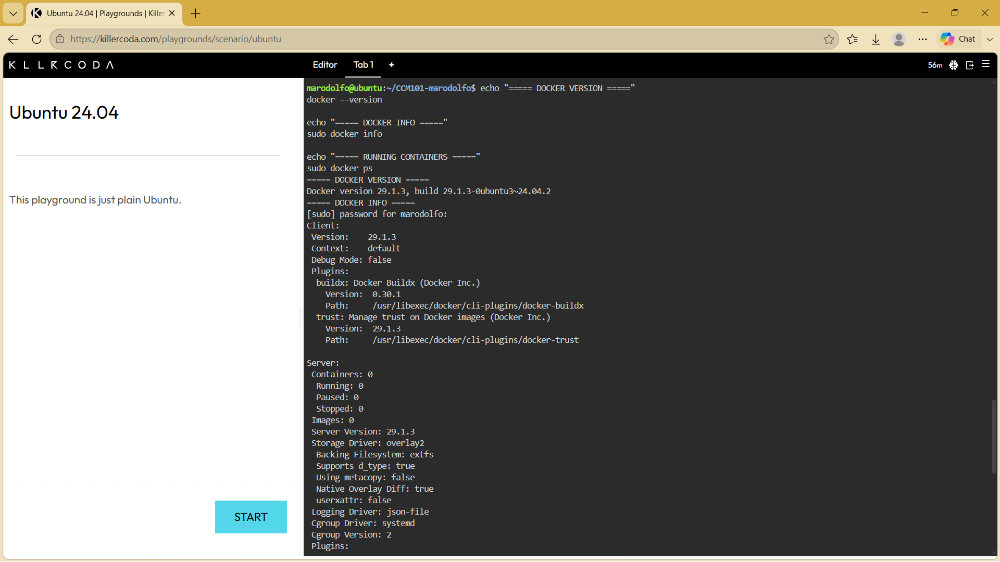
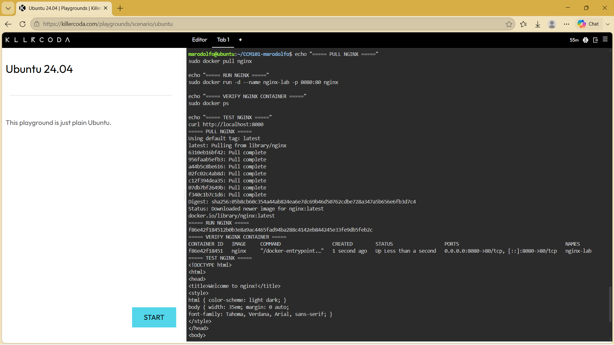
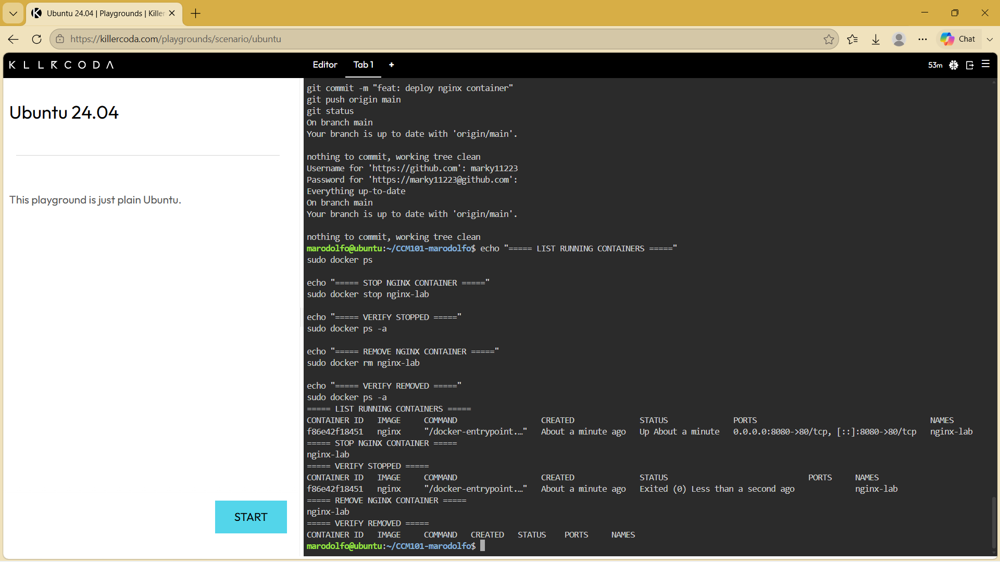

# Laboratory 04 - Cloud-Native Engineer

## Mission Overview

This laboratory explores cloud-native engineering through containerization. It focuses on the difference between traditional Virtual Machines and containers, Docker fundamentals, and the deployment and management of an Nginx web server using Docker.

## Objectives

- Differentiate between Virtual Machines and Containers.
- Access a Docker-enabled Linux environment using KillerCoda.
- Execute fundamental Docker CLI commands.
- Pull, run, manage, and remove an Nginx container.
- Document container operations using Markdown.
- Continue developing the GitHub Cloud Computing Portfolio.

## Docker Commands Executed

### Docker Verification
```bash
docker --version
docker info
docker ps
```

### Pull Nginx
```bash
docker pull nginx
```

### Run Nginx
```bash
docker run -d --name nginx-lab -p 8080:80 nginx
```

### Test Nginx
```bash
curl http://localhost:8080
```

### Container Lifecycle
```bash
docker ps
docker stop nginx-lab
docker ps -a
docker rm nginx-lab
docker ps -a
```

## Skills Learned

I learned how to use basic Docker CLI commands, download a container image, run an Nginx container, map a host port to a container port, test a web server, and manage the lifecycle of a container. I also improved my understanding of the difference between virtual machines and containers.

## Challenges Encountered

One challenge was understanding port mapping and how the host connects to a service running inside a container. Another challenge was following the correct lifecycle sequence when stopping and removing a container. Practicing the commands in the Ubuntu Playground helped me understand the process.

## Screenshots




